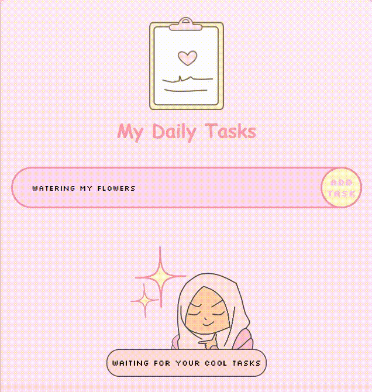

# simple yet cute Todo List Project < ♥/>

My project is a react super cute web Application for managing todos.✨ 

## visual overview 🍓 

## languages 💻

HTML, CSS and JavaScript.

## Libraries ⭐

reactJs, react-redux, redux-toolkit and Framer-Motion.

## Features 🌟

1. Add a new task.💌
2. Set a task as completed.💖
3. Delete a task.🤍
4. Sort completed and active tasks or view them all.💕

## Visual Example for the sort feature 🌟

## Managing state 💫

redux-toolkit as mentioned above.🌻

## Last note 🌼

**This is my first full project in my coding journey 🍒🚀**

### Thanks for reading ♡ ⋆｡˚ 

